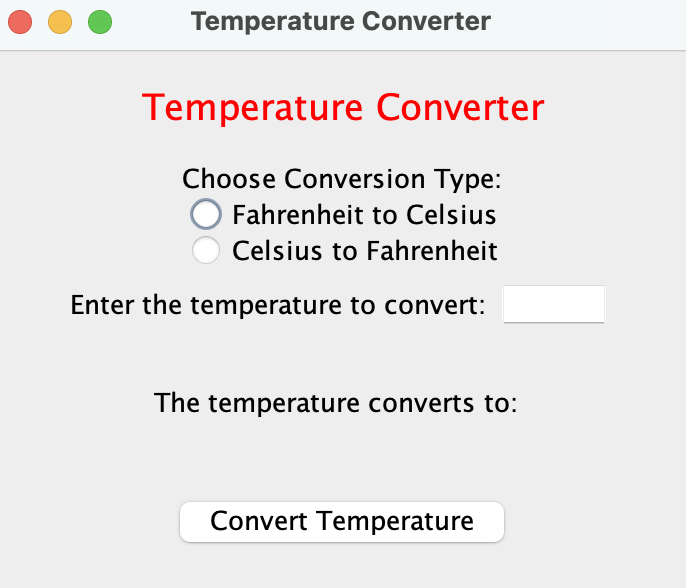

### TemperatureConverterGUI

#### Table of Contents
1. [Execution at the command line](#execution-at-the-command-line)
2. [`TemperatureConverter` Class](#temperatureconverter-class)
3. [Requirements](#requirements)

#### Execution at the command line

```
javac TemperatureConverter.java &&
java  TemperatureConverter
```



#### `TemperatureConverter` Class

```java
import java.awt.Color;
import java.awt.event.ActionEvent;
import java.awt.event.ActionListener;
import java.awt.FlowLayout;
import java.awt.Font;
import java.awt.GridLayout;
import javax.swing.ButtonGroup;
import javax.swing.JButton;
import javax.swing.JFrame;
import javax.swing.JLabel;
import javax.swing.JPanel;
import javax.swing.JRadioButton;
import javax.swing.JTextField;
import javax.swing.SwingConstants;

public class TemperatureConverter extends JFrame {
  private final ButtonGroup  radioGroup;
  private final JButton      button;
  private final JLabel       label1, label2, label3, label4, label5;
  private final JPanel       panel1, panel2, panel3, panel4;
  private final JRadioButton radioButton1, radioButton2;
  private final JTextField   textField;

  public TemperatureConverter () {
    super("Temperature Converter");
    setLayout(new GridLayout(5, 1, 0, 0));

    label1 = new JLabel("Temperature Converter",             SwingConstants.CENTER);
    label1.setForeground(Color.RED);
    label1.setFont(new Font(label1.getFont().getName(), Font.PLAIN, 18));
    label2 = new JLabel("Choose Conversion Type:",           SwingConstants.CENTER);
    label3 = new JLabel("Enter the temperature to convert:", SwingConstants.CENTER);
    label4 = new JLabel("The temperature converts to:",      SwingConstants.CENTER);
    label5 = new JLabel("",                                  SwingConstants.CENTER);

    radioGroup   = new ButtonGroup();
    radioButton1 = new JRadioButton("Fahrenheit to Celsius");
    radioButton1.setHorizontalAlignment(SwingConstants.CENTER);
    radioButton2 = new JRadioButton("Celsius to Fahrenheit");
    radioButton2.setHorizontalAlignment(SwingConstants.CENTER);
    radioGroup.add(radioButton1);
    radioGroup.add(radioButton2);

    textField = new JTextField("", 4);
    textField.setEditable(true);

    ButtonHandler handler = new ButtonHandler();
    button = new JButton("Convert Temperature");
    button.addActionListener(handler);

    panel1 = new JPanel(new GridLayout(3, 1, 0, 0));
    panel1.add(label2);
    panel1.add(radioButton1);
    panel1.add(radioButton2);
    panel2 = new JPanel();
    panel2.add(label3);
    panel2.add(textField);
    panel3 = new JPanel();
    panel3.add(label4);
    panel3.add(label5);
    panel4 = new JPanel(new FlowLayout());
    panel4.add(button);

    add(label1);
    add(panel1);
    add(panel2);
    add(panel3);
    add(panel4);
  }

  private class ButtonHandler implements ActionListener {
    @Override
    public void actionPerformed (ActionEvent e) {
      if      (radioButton1.isSelected()) label5.setText(String.format("%.1f degrees Celsius",    (5.0 / 9) * (Double.parseDouble(textField.getText()) - 32)));
      else if (radioButton2.isSelected()) label5.setText(String.format("%.1f degrees Fahrenheit", (9.0 / 5) *  Double.parseDouble(textField.getText()) + 32));
    }
  }

  public static void main (String[] args) {
    TemperatureConverter temperatureConverter = new TemperatureConverter();
                         temperatureConverter.setDefaultCloseOperation(JFrame.EXIT_ON_CLOSE);
                         temperatureConverter.setSize(350, 300);
                         temperatureConverter.setVisible(true);
  }
}
```

#### Requirements

Write a GUI program, using the NetBeans GUI generator, that will convert temperatures from fahrenheit to celsius and from celsius to fahrenheit. The user should be able to enter a temperature to convert, click on a radio button to specify which conversion to do, and then click on a button to see the converted temperature displayed.

Use the following formulas for the temperature conversions:

`F = 9 / 5 * C + 32`

and

`C = 5 / 9 * (F - 32)`

where F is the Fahrenheit temperature and C is the Celsius temperature.

The temperatures should be displayed to 1 decimal place, e.g. 93.7 degrees Fahrenheit.